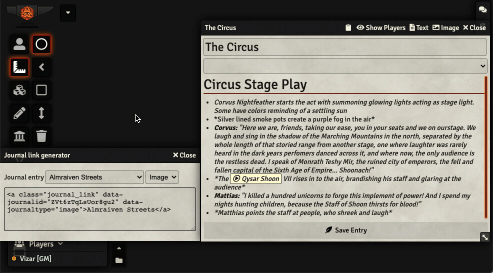

_Forked from [sound-link](https://github.com/superseva/sound-link) made by [superseva](https://github.com/superseva/)_

# Journal Link
Adds the ability to create buttons in your journals that immediately show other text or image journals to all players.

This basically saves you _one precious click_ whenever you'd like to show your party a journal without interrupting the flow of your narration. Please note that the journal **will always be shown**, regardless of the viewer's permission for this journal.

## How to use
Press the icon in your journal to open the link generator. You can either manually copy and paste the HTML into your journal or replace your current journal text selection by pressing the `Paste into journal` button.

## `Paste into journal` limitations
- Can't be used while editing a journal with the build-in text editor
- Can only replace unique texts

# Demo

## Macros to use with this module
### show-journal macro
This macro will be called by the module to open the journal entries. Create it in your game with the name `"show-journal"`

_See [show-journal macro](macros/show-journal.js)._

## Dependencies & requirements
- This module requires **The Furnace** module installed with **Advanced Macros *enabled***.
- You need to create a `show-journal` macro in your game.
