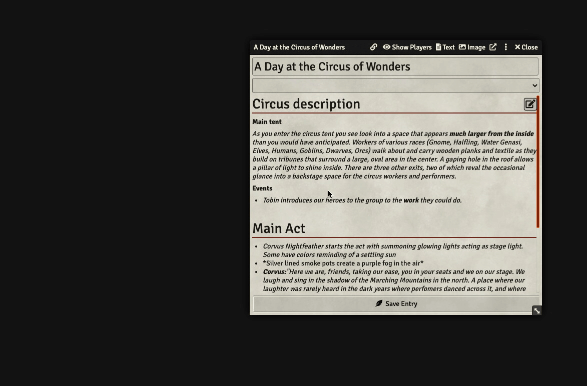

# Journal Link
Adds the ability for GMs to create buttons in journals that immediately show other text or image journals to all players.

As a GM this basically saves you _one precious click_ whenever you'd like to show your party a journal without interrupting the flow of your narration. Please note that the journal **will always be shown**, regardless of the viewer's permission for this journal.

## How to use
Press the link icon in your journal to open the link generator. You can either copy and paste the button HTML code into your journal or replace your current journal text selection by pressing the `Paste into journal` button.

### "Paste into journal" button limitations
- Can't be used while editing a journal with the text editor
- Can only replace unique text selections in the journal

# Demo

# Credits
_Inspired by [superseva](https://github.com/superseva/)'s [sound-link](https://github.com/superseva/sound-link) after I tried to figure out how to trigger a journal-embedded macro with parameters (which remains an unsolved mystery and which spawned this module as a workaround)._
